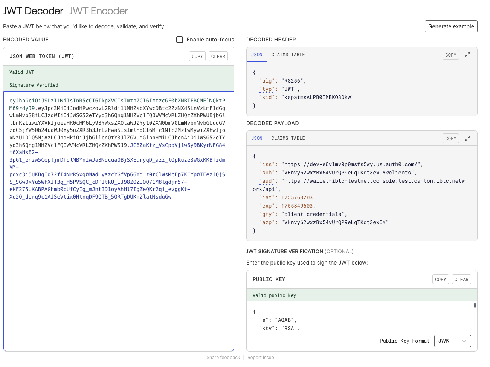
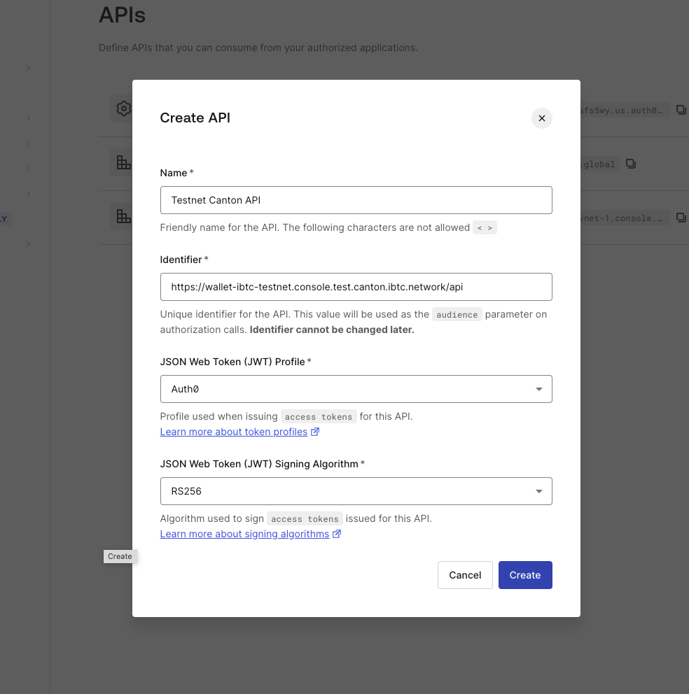
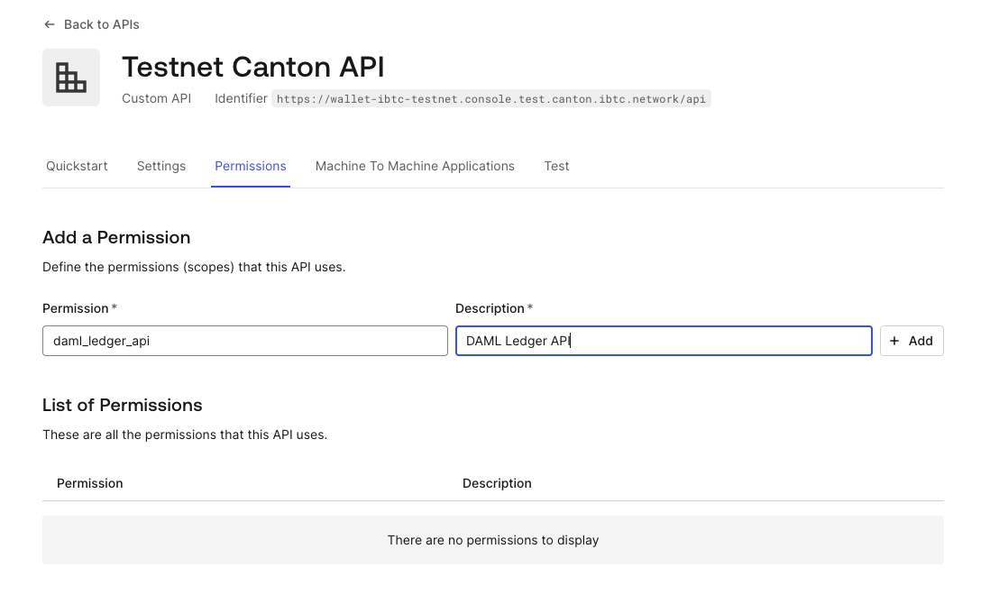
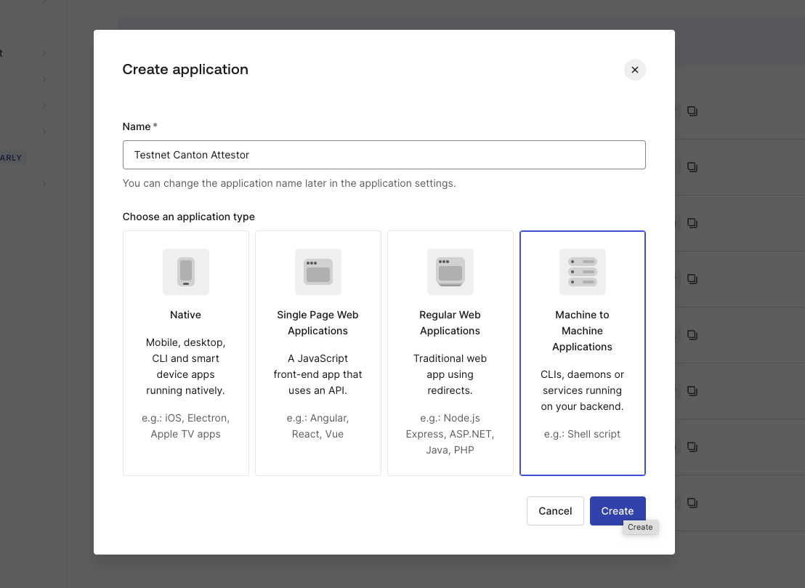
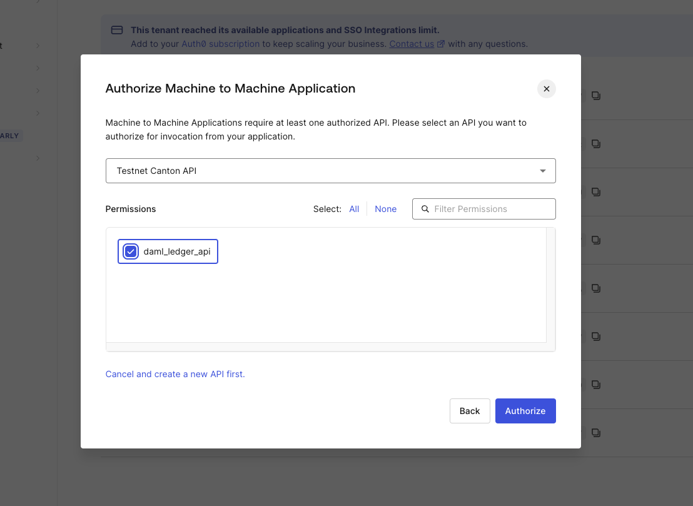
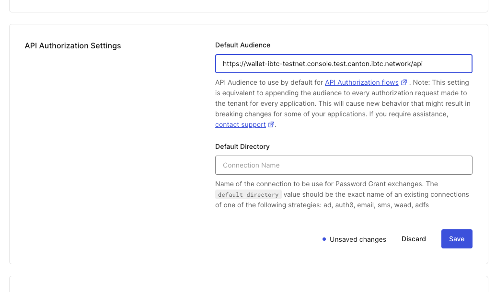

# Auth0 Client Setup Guide

This guide walks you through setting up a Auth0 client for Canton onboarding, including creating client scopes and configuring the necessary settings.

## Note!

Some of these steps may vary depending on what you have already set up. Therefore, here is the desired end stage for a JWT token:



Note the 2 most important claims:

- the `sub` claim will be used as the USER_NAME for the attestor user.
- The `aud` claim _must be_ the same as what is set in your Validator's auth_audience config.

The following steps walk you through the steps to reach this state, but note that some might already be ready for your usecase.

## Step 1: Create a New API

In `Auth0 > Applications > APIs > Create API`

- Name: for example `Testnet Canton API`
- Identifier: The Validator's auth_audience !



## Step 2: Add daml_ledger_api scope/permission

Go to `Auth0 > Applications > APIs > [Your API] > Permissions`

Enter the string daml_ledger_api into a new permission, with some description, and click Add.



## Step 3: Create an Application

In `Auth0 > Applications > Create Application`

- Name: for example `Testnet CBTC Attestor`
- Application Type: `Machine to Machine Application`



- Authorize APIs: Select the API you created in Step 1.
- Also add the created scope!



## Step 4: Set Default Audience for Tenant

This step is only required because Auth0 cannot have a default audience set at the API level. To work around this, you can set the default audience for the tenant by going to `Auth0 > Settings > General`.

- Default Audience: Set this to the API Identifier you created in Step 1.



## Step 5: Create Canton User

Now we can create a Canton user and grant it the necessary rights to interact with both the attestor party and the decentralized party we set up during bootstrapping.

Set the USER_NAME to the `sub` claim from the JWT token.
Set PARTY_NAME to the attestor party's name you created in Step 0 of the onboarding.
Then, run the CreateUserAndGrantRights.sc script, using the setups familiar from the bootstrapping (you will need a participantAdmin JWT, and the ledger_api port of the Participant node forwarded to you). Here are the steps:

```sh
export USER_NAME=replacemeRandomString@clients
export PARTY_NAME=replace-my-cbtc-attestor-party
canton run CreateUserAndGrantRights.sc -c ../misc/connect.conf
```
