# Keycloak Client Setup Guide

This guide walks you through setting up a Keycloak client for Canton onboarding, including creating client scopes and configuring the necessary settings.

## Step 1: Create a New Client

### 1.1 Navigate to Client Creation
Start by clicking the **Create client** button in your Keycloak admin console.

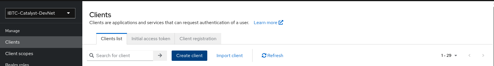

### 1.2 Client Configuration - General Settings
In the first step of client creation, configure the basic client settings:

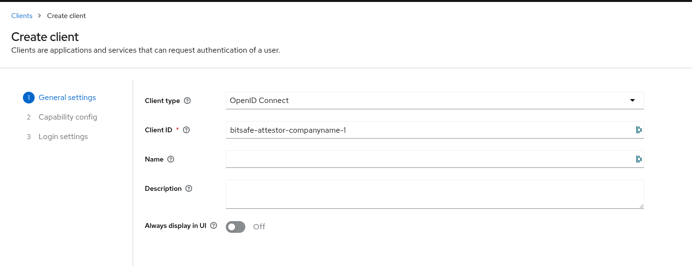

- Set the **Client type**, it should be "OpenID Connect"
- Enter the username in **Client ID** that you used when creating the Canton User
- Provide a **Name** and **Description** for easy identification, but it is optional

### 1.3 Client Configuration - Capability Config
Configure the client capabilities and authentication settings:

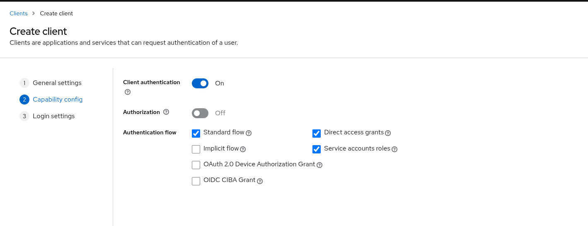

- Configure authentication flow settings
- Enable "Client authentication"
- It is important to enable the "Service accounts roles"

### 1.4 Client Configuration - Login Settings
Complete the client setup with login and access settings:

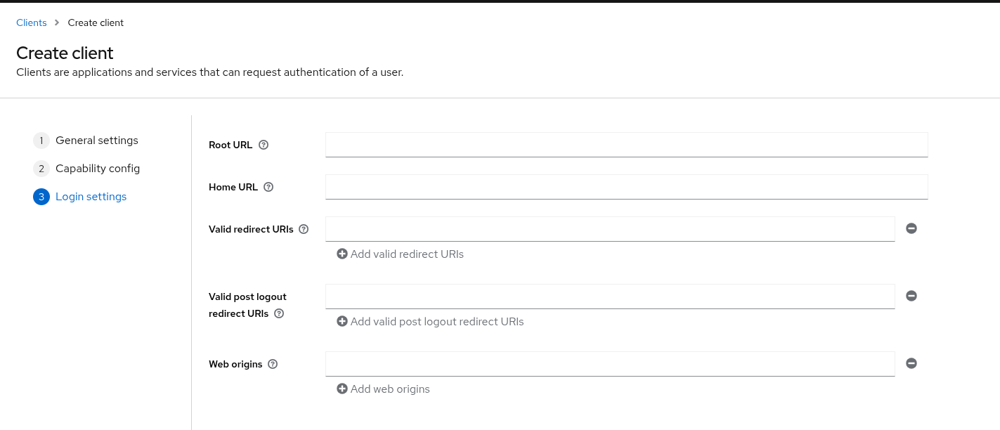

- You can leave it as it is

## Step 2: Create Client Scopes

### 2.1 Navigate to Client Scopes
Click the **Create client scope** button to add custom scopes for your client.

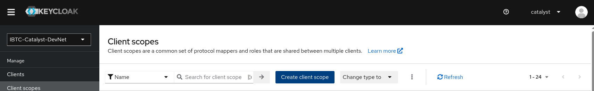

### 2.2 Configure Client Scope
Set up the client scope with appropriate settings:

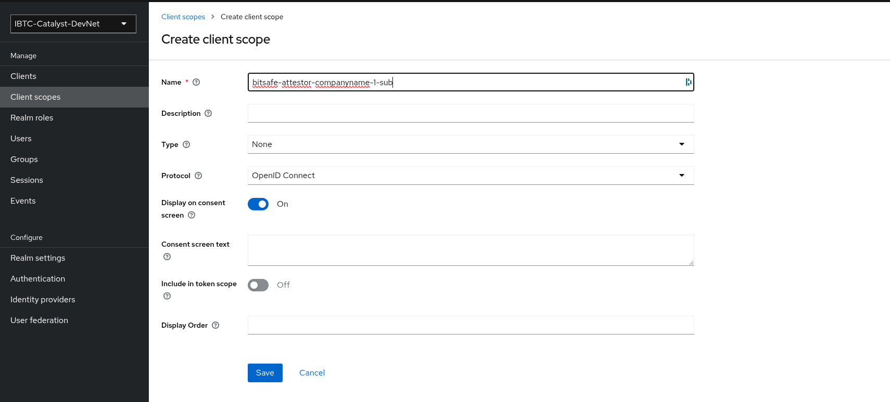

- Enter a **Name** for the scope, it can be something like the `{CLIENT_ID}-sub`
- You can leave the rest as it is

## Step 3: Configure Protocol Mappers

### 3.1 Create Protocol Mapper
Add protocol mappers to customize the tokens and user information:

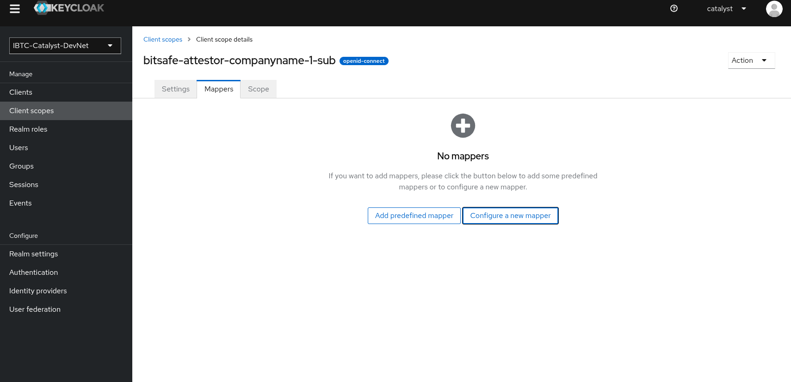

### 3.2 Select Mapper Type
Choose the "Hardcoded claim" mapper type for your requirements:

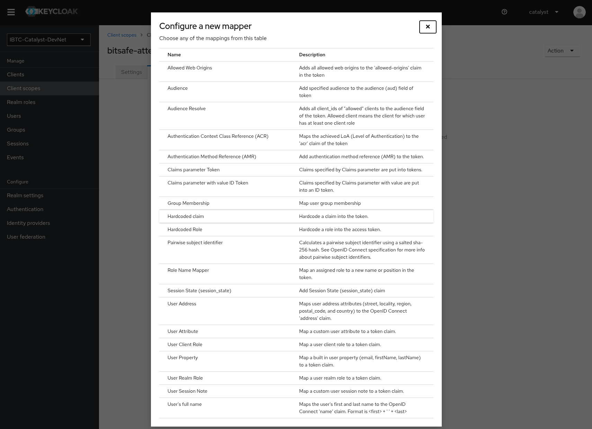

### 3.3 Configure Mapper Settings
Set up the mapper configuration:

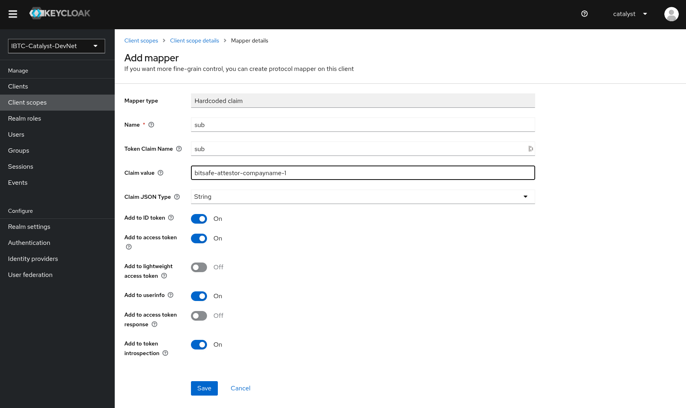

- Configure mapper name and settings, it can be `sub`
- Token claim name should be `sub`
- Claim value should be the username that you provided when you created the Canton user

### 3.4 Verify Mapper Creation
Confirm that the mapper has been created successfully:

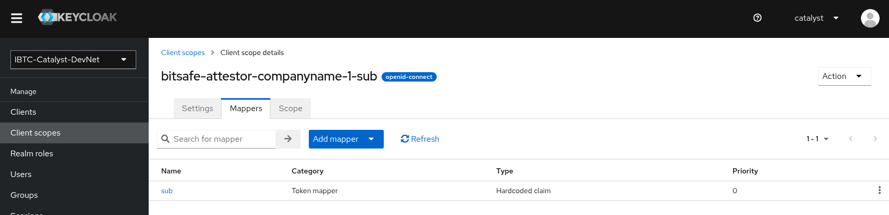

## Step 4: Assign Client Scopes to Client

### 4.1 Add Scopes to Client
Navigate back to your client and add the created scopes:

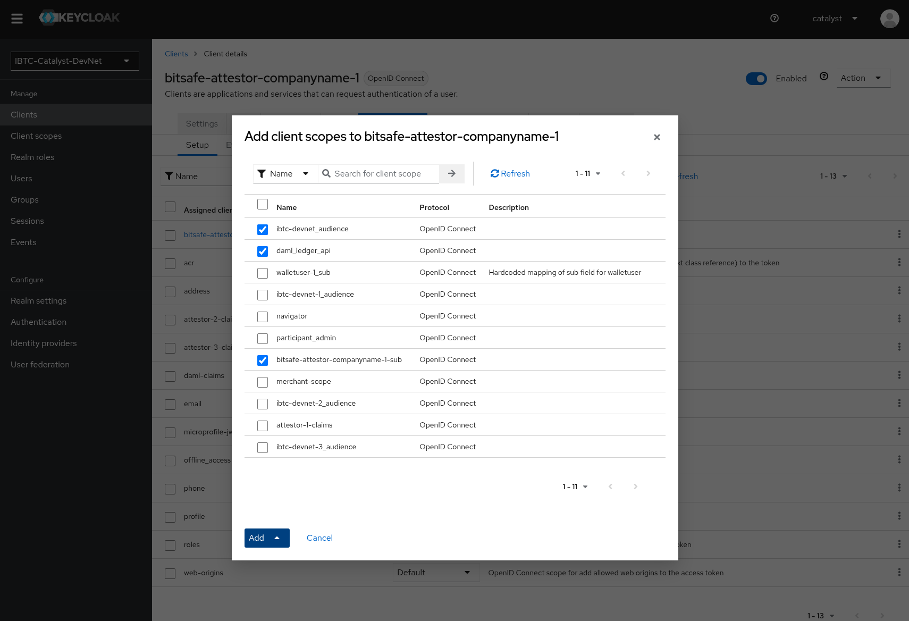

- Select the scopes
    - XXX-audience
    - daml_ledger_api
    - XXX-sub
- Add them as "Default"
- Confirm the assignment

## Step 5: Retrieve Client Credentials

### 5.1 Get Client Secret

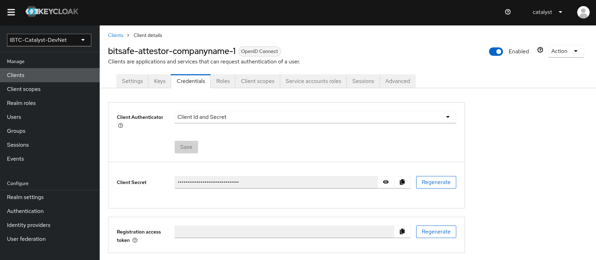

- Navigate to the **Credentials** tab of your client
- Copy the **Client secret** for use in your application configuration

## Next Steps

At this point you have a CLIENT_ID and CLIENT_SECRET.
